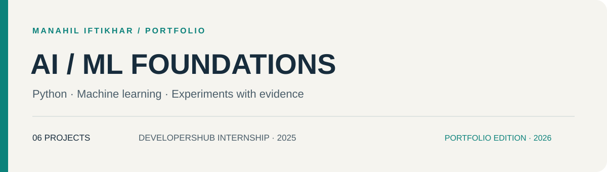
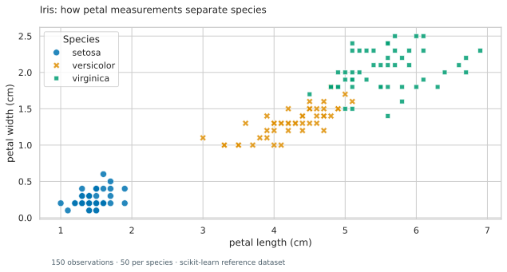

# Foundations · AI/ML internship portfolio

[](https://github.com/Manahil-Iftikhar/developershub-aiml-internship-tasks-2025/actions/workflows/checks.yml)

**Manahil Iftikhar** · Python · Machine learning · Applied AI

A collection of 6 projects originating from my 2025 DevelopersHub Corporation internship. This maintained portfolio edition adds readable project guides, local VS Code workflows, reusable Python components, and checks that make the work easier to inspect and reproduce.

[Explore projects](#projects) · [Run locally](docs/SETUP.md) · [Verification](docs/VERIFICATION.md) · [Original submissions](archive/) · [Companion collection](https://github.com/Manahil-Iftikhar/DevelopersHub-AI-ML-Internship-Assignment-2)

## Start here

Open [Iris exploration](notebooks/01-iris-exploration.ipynb) for a small example that runs without a dataset download.

Each project page explains the problem, data, current implementation, recorded evidence, and next experiment. Original assignment titles are preserved for traceability; the descriptions reflect what the code currently does.

## Projects

| Task | Project | Focus | Execution / implementation state |
| --- | --- | --- | --- |
| 1 | [Iris exploration](docs/projects/01-iris-exploration.md) | Data exploration and visual explanation | Runs offline with the core environment |
| 2 | [Stock forecasting](docs/projects/02-stock-forecasting.md) | Next-session regression and chronological evaluation | Local CSV or an explicit Yahoo Finance download required |
| 3 | [Heart disease classification](docs/projects/03-heart-disease.md) | Binary classification and error analysis | Original CSV required |
| 4 | [Health information chatbot](docs/projects/04-health-chatbot.md) | Prompt design with a pretrained text model | Model download required; responses need evaluation |
| 5 | [Support chatbot prototype](docs/projects/05-support-prototype.md) | Inspection of pretrained causal-language-model inference | Inference prototype; fine-tuning remains to be implemented |
| 6 | [House price regression](docs/projects/06-house-prices.md) | Tabular regression with reproducible preprocessing | Original CSV required; pipeline tested with synthetic fixtures |

## Verification at a glance

- **Hosted checks passed:** [GitHub Actions run 36143467044](https://github.com/Manahil-Iftikhar/developershub-aiml-internship-tasks-2025/actions/runs/36143467044) verified repository structure, notebook files, local links, original-source integrity, and focused offline tests on September 25, 2026.
- **Executed locally:** the Iris notebook ran successfully; its recorded figure appears below. The verification record reports 10 passing offline tests.
- **Scope:** synthetic test fixtures verify code behavior, not predictive performance. Full external-data and language-model runs remain pending as detailed in the [verification record](docs/VERIFICATION.md).

## A look inside



Setosa separates clearly on petal measurements in this reference sample; versicolor and virginica overlap more. The [exploration notebook](notebooks/01-iris-exploration.ipynb) connects the figure to data checks and distribution plots. [Rebuild the figure](tools/render_iris.py).

## Working in VS Code

```bash
git clone https://github.com/Manahil-Iftikhar/developershub-aiml-internship-tasks-2025.git
cd developershub-aiml-internship-tasks-2025
python -m venv .venv
```

Activate `.venv`, install `requirements-notebook.txt`, and select that environment in VS Code. See [Windows, macOS, and Linux commands](docs/SETUP.md). Install model dependencies only for the projects that need them.

## Engineering approach

- Preserve the original submissions and their recorded outputs in `archive/`.
- Keep maintained notebooks in `notebooks/` with readable names and proper `.ipynb` extensions.
- Put reusable logic in `portfolio/`; fit learned preprocessing on training data.
- Compare against baselines and select models using validation data before final test evaluation.
- Record actual results, dataset identity, and limitations together.
- Run lightweight repository checks and focused tests without downloading model weights.

## Repository guide

| Location | Contents |
| --- | --- |
| `notebooks/` | Maintained, locally oriented task notebooks |
| `portfolio/` | Reusable Python components |
| `docs/projects/` | One case study per task |
| `docs/SETUP.md` | Environments, data requirements, and run commands |
| `docs/VERIFICATION.md` | What was executed and what still needs external assets |
| `tests/` | Tests for preprocessing, evaluation, and applicable application behavior |
| `archive/` | Original notebook contents and README from 2025 |

## Provenance and scope

This is my independent internship portfolio, not a company-maintained repository. The original source is recorded at commit `725186ed2c34`. The 2026 portfolio maintenance adds organization, documentation, and revised examples; those additions should not be attributed to the original internship assessment.

Model checkpoints, missing datasets, and verified public deployments are not bundled. Historical scores are identified as such in the project pages. No repository license file was present in the original snapshot; dataset and model terms must be checked separately before redistribution.

## Author

[Manahil Iftikhar](https://github.com/Manahil-Iftikhar) · DevelopersHub Corporation AI/ML internship, 2025
